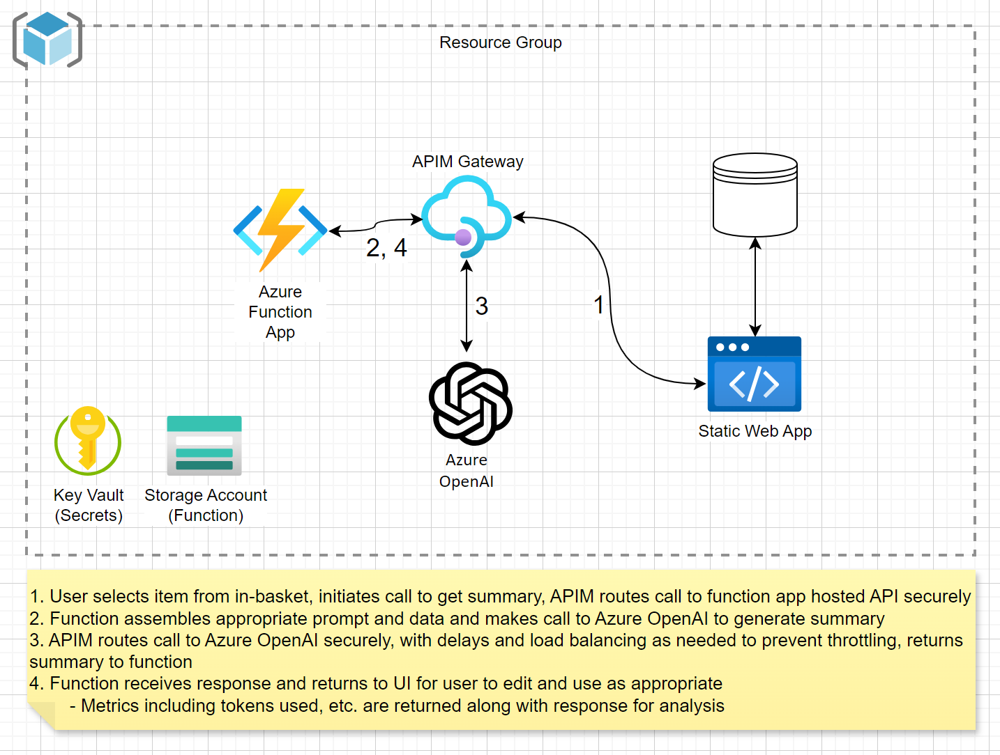
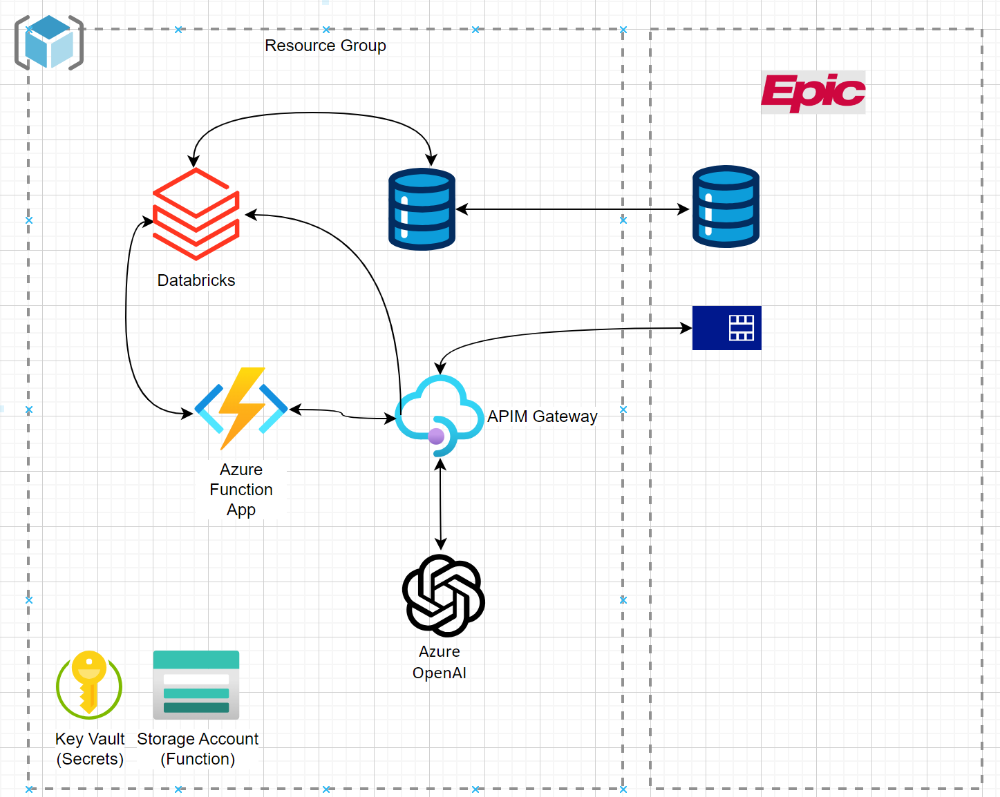

# AI Generated Lab Results Summary Template
This project provides an example template to illustrate the use of Azure OpenAI to generate a patient-facing summary of incoming lab results, including explanation of what the results mean and the implications on the patient's health. The intent is to simulate an integration with an EHR, intercepting the incoming lab results from the in-basket and passing those results along with the notes from the last encounter to the Azure OpenAI LLM to create an explanation to the patient - reducing cognitive load an time spent by clinicians and getting result information to patients more quickly.

## Architecture
This template deploys an API built and hosted by an Azure Function App, with a Static Web App Blazor front end to illustrate a user selecting a lab result from an in-basket and requesting patient-facing summary from AI. 

This template includes the reading of sample data from a local sample data file for simplicity. This could be extended with Databricks or other mechanism to pull near-real-time data, or other integration pattern, as in the example below.

## API Orchestration with Semantic Kernel
This solution includes an API defined and deployed to an Azure Function App, developed on Python with the Semantic Kernal SDK to define and orchestration prompt function calls to Azure OpenAI. 

1. Receive request on /labsummary endpoint
    * expected payload includes lab results and encounter notes
    * see HTTP request example: [fetch_patients.http](/src/Api/tests/fetch_patients.http)
2. The `summarize_labs` Semantic Kernel prompt function is called, with the lab results and encounter notes as input
    * see [summarize_labs.yaml](/src/Api/plugins/summarize_labs/summarize_labs.yaml) for prompt function definition
3. As the `summarize_labs` prompt function requires subsections of the encounter notes, the following prompt functions are called to extract that data via the Semantic Kernal AzureChatCompletion service, before calling the service a final time with `summarize_labs` prompt
    * [summarize_chief_complaint.yaml](/src/Api/plugins/summarize_note/summarize_chief_complaint.yaml)
    * [summarize_lab_history.yaml](/src/Api/plugins/summarize_note/summarize_lab_history.yaml)
    * [summarize_assessment.yaml](/src/Api/plugins/summarize_note/summarize_assessment.yaml)

Reference Documentation:
* [Semantic Kernel GitHub Repo](https://github.com/microsoft/semantic-kernel/tree/main)
* [Getting Started with Semantic Kernel (Python)](https://github.com/microsoft/semantic-kernel/blob/main/python/README.md)
* [Understanding the Kernel in Semantic Kernel](https://learn.microsoft.com/en-us/semantic-kernel/agents/kernel/?tabs=python)
* [Adding AI Services to the Kernel](https://learn.microsoft.com/en-us/semantic-kernel/agents/kernel/adding-services?tabs=python)

# Deployment Instructions
To deploy to Azure, you can follow these steps after cloning the repo into your local IDE such as VS Code. 

1. Install the Azure CLI: [How to install the Azure CLI](https://learn.microsoft.com/en-us/cli/azure/install-azure-cli)

2. Install the Azure Developer CLI (azd) extension for the Azure CLI. 

3. Log in to your Azure account by running the following command and following the prompts:
    `azd auth login`

4. Run the azd up command, and follow the prompts to indicate the subscription, region and resource group to deploy to

    `azd up`

## Contributing

This project welcomes contributions and suggestions.  Most contributions require you to agree to a
Contributor License Agreement (CLA) declaring that you have the right to, and actually do, grant us
the rights to use your contribution. For details, visit https://cla.opensource.microsoft.com.

When you submit a pull request, a CLA bot will automatically determine whether you need to provide
a CLA and decorate the PR appropriately (e.g., status check, comment). Simply follow the instructions
provided by the bot. You will only need to do this once across all repos using our CLA.

This project has adopted the [Microsoft Open Source Code of Conduct](https://opensource.microsoft.com/codeofconduct/).
For more information see the [Code of Conduct FAQ](https://opensource.microsoft.com/codeofconduct/faq/) or
contact [opencode@microsoft.com](mailto:opencode@microsoft.com) with any additional questions or comments.

## Trademarks

This project may contain trademarks or logos for projects, products, or services. Authorized use of Microsoft 
trademarks or logos is subject to and must follow 
[Microsoft's Trademark & Brand Guidelines](https://www.microsoft.com/en-us/legal/intellectualproperty/trademarks/usage/general).
Use of Microsoft trademarks or logos in modified versions of this project must not cause confusion or imply Microsoft sponsorship.
Any use of third-party trademarks or logos are subject to those third-party's policies.
